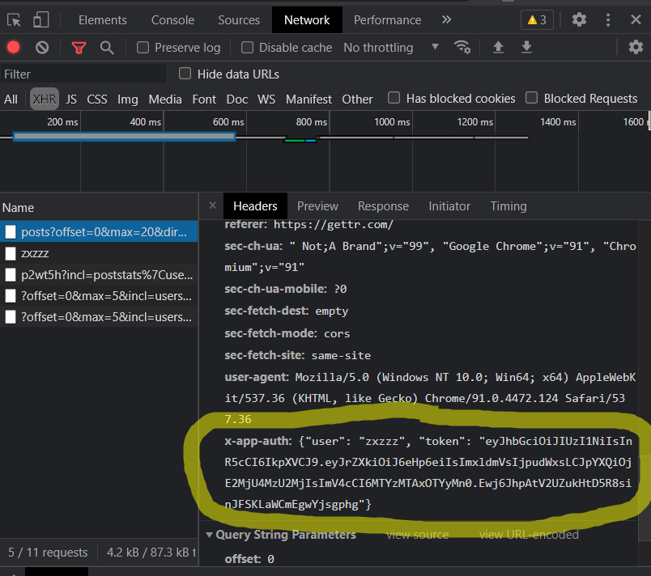

# Gettr API Clinet PHP
[](https://packagist.org/packages/beeyev/gettr-api-client-php) [](https://packagist.org/packages/beeyev/gettr-api-client-php) [](https://packagist.org/packages/beeyev/gettr-api-client-php)

A GETTR.com client library written in PHP with Laravel support.
> This library uses unofficial publicly accessible API endpoints of the website, so keep in mind that some endpoints could stop working anytime. Anyway, open an issue if something is broken or missing.

## Installation
Install the package via composer:
```bash
$ composer require beeyev/gettr-api-client-php
```

Optionally, if you use Laravel, you can publish the config file of this package with this command:
``` bash
$ php artisan vendor:publish --provider="Beeyev\GettrApiClient\Adapters\Laravel\GettrServiceProvider" --tag=config
```
The following config file will be published in `config/gettr.php`, set `user` and `token` if you want to use methods which require  authorization.  Read on to find out where to get an authorization token.
```php
return [  
  'user'  => '',  
  'token' => '',  
];
```

## How to obtain the credentials to communicate with Gettr
1. Authenticate on [gettr.com](https://gettr.com/)
2. Open dev tools in browser and find `username` and `token` values inside `x-app-auth` in the HTTP request header of any call to an `api.gettr.com` endpoint.
<details>
  <summary>Show screenshot</summary>


</details>


## How to use
Example
```php
use Beeyev\GettrApiClient\Gettr;

$user = 'username';  
$token = 'token';  
$gettr = new Gettr($user, $token); //Initial values are optional  
$postData = $gettr->post()->get('p4e8x3'); // Read on to explore all available methods
```
Or you can just use Laravel facades
```php
$postData = \Gettr::post()->get('p4e8x3'); //Will return an array of raw json
$userPostsData = \Gettr::post()->getUserPosts('enzo20');
```

API methods using Laravel facades:

**Posts**
```php
//Get a post
Gettr::post()->get(string $postId);

//Deletes user's post
Gettr::post()->delete(string $postId);

//Make a repost
Gettr::post()->repost(string $postId);

//Undo a repost
Gettr::post()->undoRepost(string $postId);

//Get a user's posts
Gettr::post()->getUserPosts(string $username, int $offset = 0, int $maximum = 20, string $direction = 'rev');

//Get a user's replies
Gettr::post()->getUserReplies(string $username, int $offset = 0, int $maximum = 20, string $direction = 'rev');

//Returns a user's media
Gettr::post()->getUserMedia(string $username, int $offset = 0, int $maximum = 20, string $direction = 'rev');

//Returns a list of posts which were liked by a user
Gettr::post()->getPostsLikedByUser(string $username, int $offset = 0, int $maximum = 20, string $direction = 'rev');

//Returns a list of users who liked a post
Gettr::post()->getUsersLikedPost(string $postId, int $offset = 0, int $maximum = 20, string $direction = 'rev');

//Returns a list of users who reposted a post
Gettr::post()->getUsersRepostedPost(string $postId, int $offset = 0, int $maximum = 20, string $direction = 'rev');

//Returns a post's comments.
Gettr::post()->comments(string $postId, int $offset = 0, int $maximum = 20, string $direction = 'rev');

//Searches posts with a phrase
Gettr::post()->search(string $query, int $offset = 0, int $maximum = 20);

//Pins a specified post
//This will pin a post at the top of your profile and replace any previously pinned
Gettr::post()->pin(string $postId);

//Create a new post
//Unfortunately I did not have enough time to figure it out how this API method should work.
//Quote post and Reply methods work the same, so this is why I did not even try to implement them.
//I will appreciate if smb would help me with this.
//Gettr::post()->create(string $text);


```

**Likes**
```php
//Like a post
//The result will also contain total number of likes but only when you make a change
Gettr::like()->likePost(string $postId);

//Unlike a post
Gettr::like()->unlikePost(string $postId);

//Like a comment.
Gettr::like()->likeComment(string $commentId);

//Unlike a comment
Gettr::like()->unlikeComment(string $commentId);

//Get all posts liked by a user
Gettr::like()->getPostsLikedByUser(string $username);
```

**Users**
```php
//Get User information
Gettr::user()->info(string $username);

//Follow a user
Gettr::user()->follow(string $username);

//Unfollow a user
Gettr::user()->unfollow(string $username);

//Mute a user
Gettr::user()->mute(string $username);

//Unmute a user
Gettr::user()->unmute(string $username);

//Returns list of muted users. ! Require authorisation
Gettr::user()->getMutes(int $offset = 0, int $maximum = 20);

//Block a user. ! Require authorisation
Gettr::user()->block(string $username);

//Unblock a user. ! Require authorisation
Gettr::user()->unblock(string $username);

//Returns list of blocked users. ! Require authorisation
Gettr::user()->getBlocked(int $offset = 0, int $maximum = 20);

//Searches users
Gettr::user()->search(string $query,  int $offset = 0, int $maximum = 20);

//Check if Username exists
Gettr::user()->checkIfUsernameExists(string $username);

//Returns list of user follows.
Gettr::user()->followings(string $username, int $offset = 0, int $maximum = 20);

//Returns a list of user followers.
Gettr::user()->followers(string $username, int $offset = 0, int $maximum = 20);

//Returns current user's timeline, (same thing what you see on the home page)
Gettr::user()->timeline(int $offset = 0, int $maximum = 20, string $direction = 'rev');
```

**Suggestions**
```php
//Returns a list of suggested users.
Gettr::suggested()->users(int $offset = 0, int $maximum = 20);

//Returns a list of suggested hashtags.
Gettr::suggested()->hashtags(int $offset = 0, int $maximum = 20);
```

## Testing
¯\_(ツ)_/¯

## License
The MIT License (MIT). Please see [License File](LICENSE.md) for more information.
